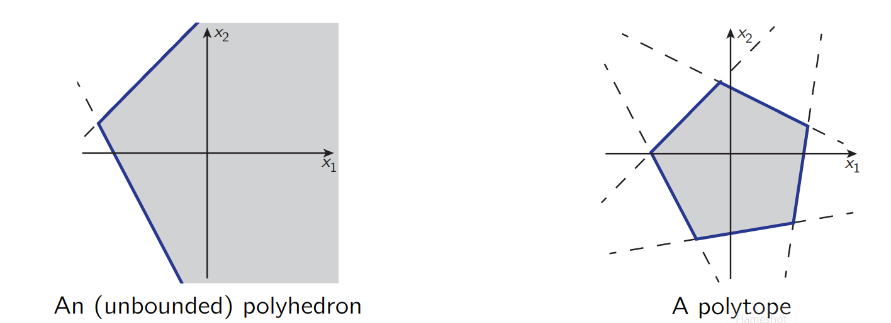
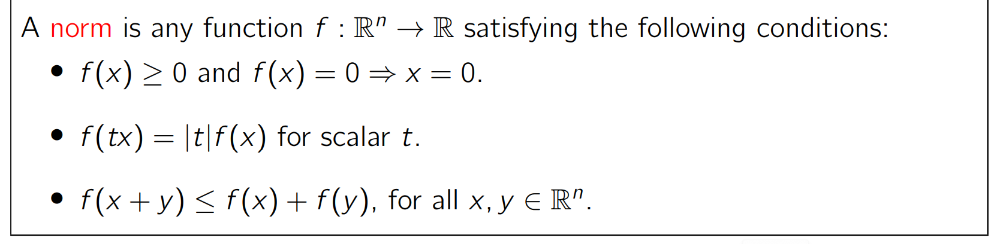

[toc\]


----

# 1 “Easier” problems


上面的图，其中多边形是由不等约束的多个半平面组成的


相等约束则是超平面


# 2 “Harder” problems


# A simple optimization problem


## 使用matlab+cvx插件的实现：
```matlab
% matlab的cvx插件安装看D:\GitHub\DayCollection\cvx\cvx_4_matlab\code_and_bin\readme.md

% 这个代码在 D:\GitHub\DayCollection\mpc\ESE-619-Model-Predictive-Control-main\mycode\example4_1_cvx.m

cvx_begin
    %define cost function
    variables x1 x2
    %define constraints
    minimize(abs(x1 + 5) + abs(x2-3))
    subject to
    2.5 <= x1 <= 5
    -1 <= x2 <=1
cvx_end %solves automatically

```

##  cvxpy的实现

这个问题跟《凸优化》里面的Chebyshev approximation problem 很像，需要转化成线性规划

```py
# D:\GitHub\DayCollection\mpc\ESE-619-Model-Predictive-Control-main\mycode\example4_1_cvxpy.py


# 该问题通过通义千问得到答案，结果和cvx+matlab的一致
# 我们可以将绝对值函数转换为线性规划问题。具体来说，可以引入辅助变量 
# t1,t2，使得： t1>=x1+5,t1 >= -(x1+5),t2 >=x2 -3, t2 >=-(x2-3)
#  然后最小化 t1+t2

import cvxpy as cp

# 义变量
x1 = cp.Variable()
x2 = cp.Variable()

# 定义辅助变量
t1 = cp.Variable()
t2 = cp.Variable()

# 目标函数
objective = cp.Minimize(t1 + t2)

# 约束条件
constraints = [
    t1 >= x1 + 5,
    t1 >= -(x1 + 5),
    t2 >= x2 - 3,
    t2 >= -(x2 - 3),
    2.5 <= x1,
    x1 <= 5,
    -1 <= x2,
    x2 <= 1
]

# 创建并求解优化问题
problem = cp.Problem(objective, constraints)
result = problem.solve()

# 输出结果
print("Optimal value: ", result)
print("Optimal variables: x1 =", x1.value, "x2 =", x2.value)


# Optimal value:  9.499999996951702
# Optimal variables: x1 = 2.500000001101575 x2 = 1.0000000021870945

```


-----

# 1 Convex Set 凸集定义


## 1.1 Affine sets and Subspaces 仿射集和子空间

>An affine set is a convex set


## 1.2 Hyperplanes and halfspaces 超平面和半平面 


## 1.3 Cone 锥

>A cone is not necessarily convex


## 1.4 Polyhedra and polytopes

>Polyhedra and polytopes are always convex.



# 2 norm 范数

norm的定义：



## 2.1 L<sub>p</sub> norm


----

# 3 凸集运算

## 3.1 凸集的交还是凸集

## 3.2 凸包 convex hull 包含集合的最小凸集

## 3.3 凸集的并不一定是凸集


----
# 4 凸函数

定义


## 4.1 凸函数的一阶导情况


## 4.2 凸函数的二阶导情况


## 4.3 Epigraph of a Function


## 4.3 Level set


>contour lines:等高线

## 4.3.1 Sublevel set


----

# 5 LP问题 Example Linear Programs

## 5.1 Cheapest cat-food problem:

