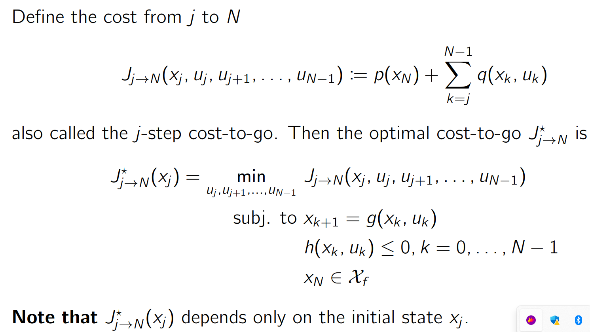
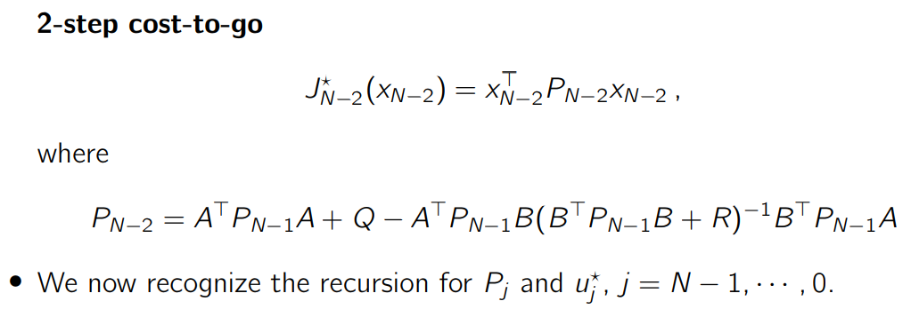
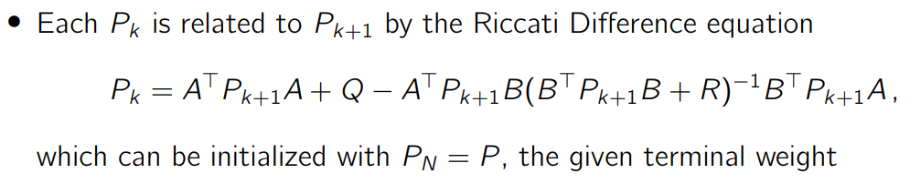
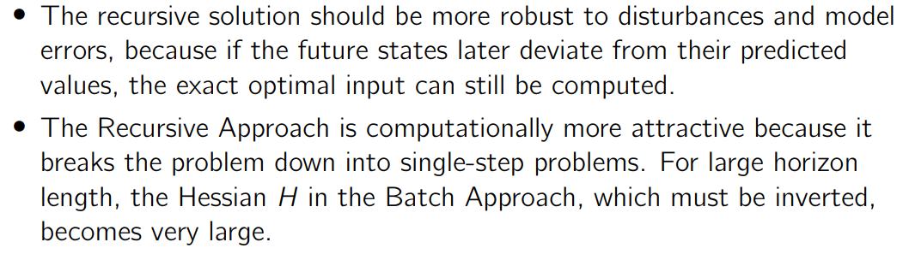

[toc]


-----

## 一些思考

### cost函数的两部分的含义


+ state cost:是指去到目标的过程的cost
+ optimal cost-to-go:是指跟最后一个点跟目标实际的差异。这个单独开来，
表示要求其权重比较高，要求尽量接近最终的目标


### Principle of optimality的思考

现实中真是这样吗?

### 所有公式里面的x，是指差值吗？


-----

 
## 1.2 Solution approach 2: Recursive Approach 递归处理方法


### 1.2.1 Theorem: Principle of optimality


Principle of Optimality 是动态规划中的一个核心定理或原则，它由美国数学家 Richard Bellman 在 20世纪50年代提出。这个原理是解决优化问题的基础之一，并且在算法设计中扮演着关键角色。

原则表述
**Principle of Optimality 的基本思想可以表述为：在一个多阶段决策过程中，如果从起点到终点的全程最优解已经确定，那么无论起始点如何选择，任何子路径也必须构成该部分的最优解。换句话说，在寻求全局最优解的过程中，所有中间步骤的选择也必须是最优的。**
应用
这个原则通常用于构建动态规划算法。通过将一个问题分解成更小的重叠子问题，并保证每个子问题的解都是最优的，我们能够有效地找到整个问题的解决方案。动态规划依赖于存储和重用子问题的解来避免重复计算，从而提高效率。

例如，在最短路径问题中，如果我们知道节点 A 到节点 B 的最短路径，那么这条路径上的任意两个中间节点间的路径也是这两个节点间的最短路径。

示例
一个经典的例子是使用动态规划求解斐波那契数列。根据 Principle of Optimality，我们可以从基础情况开始（如 F(0)=0, F(1)=1），然后逐步构建更高阶的结果，确保每一步都基于前面步骤的最优解进行计算。

理解 Principle of Optimality 对于掌握动态规划方法至关重要，它不仅帮助我们设计高效的算法，还指导我们识别哪些问题可以通过这种方法得到有效解决。


### 1.2.2 Recursive Approach的问题定义



### 1.2.3 简化符号后的公式


-----

# 2 Linear Quadratic Optimal Control：批处理和递归处理对于解决线性系统的控制    

## 2.1 线性系统的形式以及其控制优化的cost形式


> Batch Approach 批处理方法是计算输入的一系列值
> Recursive Approach 递归处理方法是使用Dynamic Programming来计算
> 控制的策略，比如说用函数描述控制的决策是怎么依赖系统的状态的


## 2.2 Unconstrained Finite Horizon Control Problem 线性问题的有限步预测


## 2.3 线性问题有限步预测的Batch Approach实现


>因为我们是根据促使状态值，推导接下去的第一个点，第二个点。。。。
最后一个点的输入，从第二个点开始其开始的状态都是通过预测
得到，不是测量得到，所以是open loop


### 2.3.1 Batch Approach的公式推导


>S<sup>x</sup>的列跟A一样，行数=(预测步数N+1) * (A的行数)
```matlab
    n = size(A, 1);
    m = size(B, 2);
    Sx = zeros((N+1)*n, n);
    for i = 0:N
        Sx(i*n+1:(i+1)*n, 1:n) = A^i;
    end
```

>S<sup>u</sup>的列= A的列 * N，行数 = （N+1） *B的行数

```matlab
    for i = 0:N
        %依次构建Su的每一行
        for j = 0:N-1
            Su(i*n+1:(i+1)*n, j*m+1:(j+1)*m) = (i-j-1>=0)*A^(i-j-1)*B;
        end
    end
```
>n=2,是A的行数,m = 1,是B的列数

> i * n + 1表示每次迭代都是以A的行数增加，+1是因为i是从0开始，而matlab的下标是从1开始的
> (i+1) * n = i * n + n,这样子就跟 i * n + 1一起定义了一个A的行数的下标范围

>i=0的时候
>内循环：i*n+1 = 1,(i+1)*n = 2,这部分在一个内循环里保持不变，因此i=0的内循环，更新的都是1到2行的数据
>j=0,j*m+1 = 1,(j+1)*m = 1
>Su矩阵的右上角的值都是0，在右上角的元素，行数是大于列数的，所以可以用(i-j-1>=0)来判断是否是右上角的元素，如果是，(i-j-1>=0)*A^(i-j-1)*B=[0;0],如果不是，则计算这个位置的元素的方法是 A^(i-j-1)*B
>


```matlab
    I = eye(N);
    Q_bar = kron(I, Q);
    Q_bar(end+1:end+n, end+1:end+n) = P_N;
    R_bar = kron(I, R);
    H = Su'*Q_bar*Su + R_bar;
    F = Sx'*Q_bar*Su;
```
>kron函数的作用
>
>Q_bar = kron(I, Q);利用了kron函数的特性，来构建= blockdiag(Q, . . . , Q, P)，然后再对其扩展，使用 Q_bar(end+1:end+n, end+1:end+n) = P_N，讲Q_bar的最后部分扩展为P_N
>R_bar = kron(I, R)也是如此

>cost的形式是一个正定二次式，运用凸优化的理论，其最小值在其
导数为0的时候取得。根据这个结论，我们可以得到最优解得形式


>解析解：U = -H^-1*F'*x0;
>然后将U的结果代回J的公式：J = U'*H*U + 2*x0'*F*U + x0'*Sx'*Q_bar*Sx*x0;


### 2.3.2 代码实现
**matlab代码的实现：D:\GitHub\DayCollection\mpc\ESE-619-Model-Predictive-Control-main\mycode\example5_1_batch_approach.m**

**py代码的实现：D:\GitHub\DayCollection\mpc\ESE-619-Model-Predictive-Control-main\mycode\example5_1_batch_approach.py**

**c++实现：D:\GitHub\DayCollection\mpc\ESE-619-Model-Predictive-Control-main\mycode\example5_1**


## 2.4 线性问题有限步预测的Recursive Approach

N步预测，从第j个采样点预测到最后点的定义


### 2.4.1 考虑只预测一步的情况

考虑极端的情况，从N-1个采样点，预测到最后一个采样点，也就是N采样点


上面的式子，就是 QP的形式，所以有全局最小值


### 2.4.2 根据 Bellman’s Principle of Optimality，从1步推到2步


在一步的基础上，再加上一步，就得到了2步的预测


因此，这里是再次求一步的预测最优,跟1步预测的完全一样


>作为比较，这里贴出一步预测时的U:

>形式上，两者十分相似




>作为比较，这里贴出一步预测时的J:

>形式上，两者十分相似


根据1步，2步的结论，我们递推出N步预测的公式：

**Discrete Time Riccati equation or Riccati Difference equation (RDE).**


上面的公式就是从第一个采样点开始预测的cost的解

### 2.4.3 小结 




**matlab例子代码D:\GitHub\DayCollection\mpc\ESE-619-Model-Predictie-Control-main\mycode\example5_1_recursive_approaches.m**

### 2.4.4  Comparison of Batch and Recursive Approaches 批处理和递归处理的比较





# 3 无限视界的预测

**Algebraic Riccati equation (ARE)**


