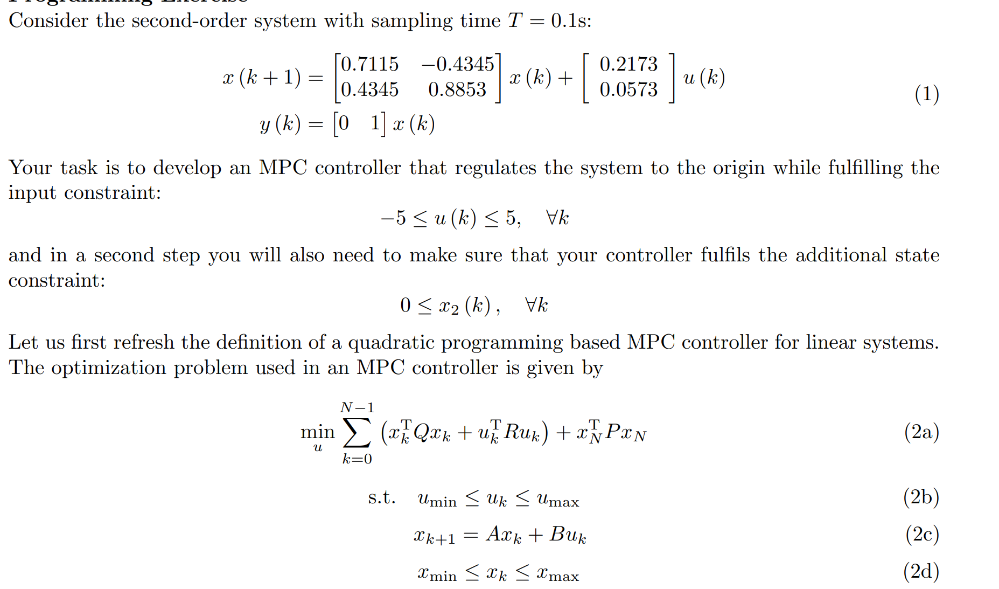
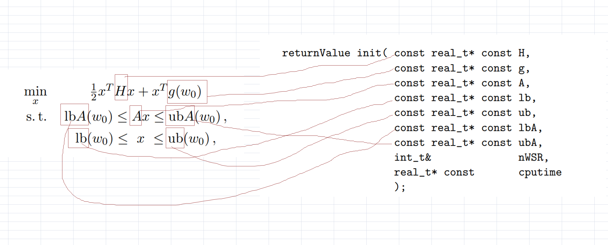

# 实现代码

# <a href="https://github.com/mathnovel/mathnovel.github.io/tree/main/mpc/06CFTOC/exampleHW4_4"> 实现代码 </a>


------

# 1 Su,Sx的构建


>注意，预测的视界位N的话，Sx应该是（N + 1) * n, n),Su是((N + 1) * n, N * m)


```c++
// Helper function to compute matrix power
MatrixXd matrix_power(const MatrixXd& A, int power) {
    if (power == 0) {
        return MatrixXd::Identity(A.rows(), A.cols());
    }
    if (power == 1) {
        return A;
    }
    return A * matrix_power(A, power - 1);
}
```


```c++
    int n = A.rows();
    int m = B.cols();

    // First, rollout the dynamics to get Sx and Su
    MatrixXd Sx = MatrixXd::Zero((N + 1) * n, n);
    MatrixXd Su = MatrixXd::Zero((N + 1) * n, N * m);

    // Calculate Sx and Su
    for (int i = 0; i <= N; i++) {
        MatrixXd A_power = matrix_power(A, i);
        Sx.block(i * n, 0, n, n) = A_power;

        for (int j = 0; j < N; j++) {
            if (i - j - 1 >= 0) {
                MatrixXd A_power_diff = matrix_power(A, i - j - 1);
                Su.block(i * n, j * m, n, m) = A_power_diff * B;
            }
        }
    }
```

# 2 Q_bar,R_bar的构建


```c++
MatrixXd kroneckerProduct(const MatrixXd& A, const MatrixXd& B) {
    MatrixXd result(A.rows() * B.rows(), A.cols() * B.cols());
    for (int i = 0; i < A.rows(); i++) {
        for (int j = 0; j < A.cols(); j++) {
            result.block(i * B.rows(), j * B.cols(), B.rows(), B.cols()) = A(i, j) * B;
        }
    }
    return result;
}
```

```C++
    // Stack-up weight matrices
    MatrixXd I = MatrixXd::Identity(N, N);
    MatrixXd Q_bar = kroneckerProduct(I, Q);
    MatrixXd Q_bar_extended(Q_bar.rows() + n, Q_bar.cols() + n);
    Q_bar_extended << Q_bar, MatrixXd::Zero(Q_bar.rows(), n),
        MatrixXd::Zero(n, Q_bar.cols()), P_N;

    MatrixXd R_bar = R * MatrixXd::Identity(N, N);
```

# 3 H,F的构建


```c++
    H = Su.transpose() * Q_bar_extended * Su + R_bar;
    H = (H + H.transpose()) / 2.0;//这里除以2是为了构建QP形式给qpOASES用
    F = Sx.transpose() * Q_bar_extended * Su;
```


J的最后一部分没有构建，是因为J优化的时候不需要，因为这项没有涉及到需要求解的U


如果需要，是下面的形式
```c++
Y = x'*Sx'*Q_bar*Sx*x;
```


# 4 qpOASES问题的构建


```c++
    Eigen::MatrixXd H;
    Eigen::MatrixXd g;

    //H,Gj就是我们构建的H,F
    getPredictionMatrices(H, g, x);

    qpOASES::QProblem qp(N, 0);
    qpOASES::Options options;
    options.printLevel = qpOASES::PL_NONE;
    qp.setOptions(options);

    Eigen::VectorXd lb = Eigen::VectorXd::Constant(N, umin);
    Eigen::VectorXd ub = Eigen::VectorXd::Constant(N, umax);

    int nWSR = 100;
    //这里没有lbA<= Ax <= ubA,所以第3，6，7个参数给null即可
    qp.init(H.data(), g.data(), nullptr, lb.data(), ub.data(), nullptr, nullptr, nWSR);
```


# 5 Pn的两种构建方式：李雅普诺夫方式和LQR方式

```c++
 A.resize(2, 2);
    A << 0.7115, -0.4345,
        0.4345, 0.8853;

    B.resize(2, 1);
    B << 0.2173,
        0.0573;

    C.resize(1, 2);
    C << 0, 1;

    // MPC parameters
    Ts = 0.1;
    N = 5;
    Q =  Eigen::MatrixXd::Identity(2, 2);
    R = 1.0;

    x0.resize(2);
    x0 << 0, 10;

    T_sim = 6.0;
    Nsim = T_sim / Ts;

    umin = -5.0;
    umax = 5.0;

    // Get terminal weight using DLQR
    Eigen::MatrixXd P_dlqr;
    Eigen::MatrixXd K;
    dlqr(A, B, Q, R, K, P_dlqr);

    cout<<"dlqr P_n = "<<P_dlqr<<endl;
    cout<<"-----------------------"<<endl;

    Eigen::MatrixXd P_dlyap = dlyap(A, Q);
     cout<<"dlyap P_dlyap = "<<P_dlyap<<endl;
```


## LQR方式

```c++


void MPCController::dlqr(const Eigen::MatrixXd& A, const Eigen::MatrixXd& B,
          const Eigen::MatrixXd& Q, const double R,
          Eigen::MatrixXd& K, Eigen::MatrixXd& P)
{
    const int max_iter = 10000;
    const double eps = 1e-8;
    const int m = B.cols();

    // Initialize P with Q
    P = Q;
    Eigen::MatrixXd P_next;

    // Create R matrix from scalar R
    Eigen::MatrixXd R_mat = R * Eigen::MatrixXd::Identity(m, m);

    // Solve Discrete Algebraic Riccati Equation (DARE) iteratively
    for (int i = 0; i < max_iter; ++i) {
        // Compute K = (R + B'PB)^(-1)*(B'PA)
        Eigen::MatrixXd BtP = B.transpose() * P;
        Eigen::MatrixXd K_temp = (R_mat + BtP * B).inverse() * (BtP * A);

        // Update P using the Riccati difference equation
        P_next = Q + A.transpose() * P * A -
                 A.transpose() * P * B * K_temp;

        // Check convergence
        if ((P_next - P).norm() < eps) {
            P = P_next;
            K = K_temp;
            return;
        }

        P = P_next;
    }

    std::cerr << "Warning: DLQR did not converge after " << max_iter << " iterations" << std::endl;
    K = (R_mat + B.transpose() * P * B).inverse() * (B.transpose() * P * A);
}
```

## 李亚普诺夫方式

```c++

Eigen::MatrixXd MPCController::dlyap(const Eigen::MatrixXd& A, const Eigen::MatrixXd& Q) {
    const int n = A.rows();

    // Convert the Lyapunov equation to a linear system Mx = b
    Eigen::MatrixXd M = Eigen::MatrixXd::Zero(n * n, n * n);
    Eigen::VectorXd b = Eigen::VectorXd::Zero(n * n);

    // Build M matrix: I ⊗ (A⊗A) - I
    Eigen::MatrixXd I = Eigen::MatrixXd::Identity(n, n);

    // Construct the Kronecker product A⊗A
    for (int i = 0; i < n; i++) {
        for (int j = 0; j < n; j++) {
            M.block(i*n, j*n, n, n) = A(i,j) * A;
        }
    }

    M = M - Eigen::MatrixXd::Identity(n*n, n*n);

    // Convert Q to vector form for the right-hand side
    for (int i = 0; i < n; i++) {
        for (int j = 0; j < n; j++) {
            b(i*n + j) = -Q(i,j);
        }
    }

    // Solve the linear system
    Eigen::VectorXd x = M.colPivHouseholderQr().solve(b);

    // Convert solution back to matrix form
    Eigen::MatrixXd X = Eigen::MatrixXd::Zero(n, n);
    for (int i = 0; i < n; i++) {
        for (int j = 0; j < n; j++) {
            X(i,j) = x(i*n + j);
        }
    }

    // Ensure symmetry
    X = (X + X.transpose()) / 2.0;

    return X;
}

```

```
dlqr P_n =  
3.80974 0.963992
0.963992  4.51728
-----------------------
dlyap P_dlyap =   
5.53194 -0.999496
-0.999496   5.89815
```