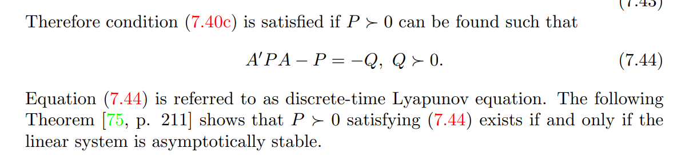
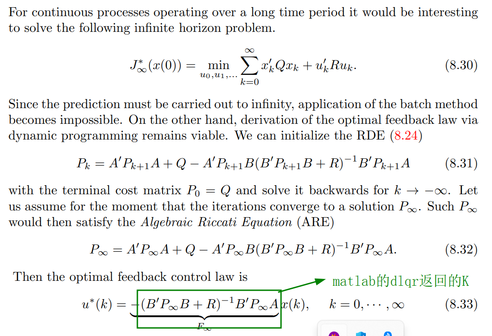
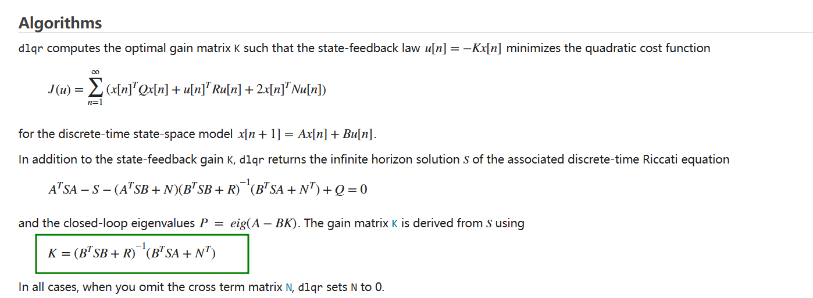

 
# ternimal cost的PN的计算，P不是随便给的，可以有两种方式计算出好的P，一个是李雅普诺夫，一个是LQR

>**使用李雅普诺夫来计算P的资料来源：**《Predictive control for linear and hybrid system》 7.5.2

>matlab的dlyap函数计算的是X = dlyap(A,Q) 求解离散时间李雅普诺夫方程 AXA<sup>T</sup> − X + Q = 0，
其中 A 和 Q 是 n×n 矩阵。
当 Q 对称时，解 X 为对称解；当 Q 为正定且 A 的所有特征值都在单位圆内时，解 X 为正定解。


>**dlqr计算P的原理**
>《Predictive control for linear and hybrid system》 8.5

>matlab的dlqr计算的算法；


---

# c++的代码实现


## 头文件

```c++
#pragma once


class CalcDlyapAndDlqr
{
public:
	int Calc();
 
};
 ```

## cpp文件

```c++
#include "CalcDlyapAndDlqr.h"
#include <Eigen/Dense>
#include <iostream>

using namespace Eigen;
using namespace std;


/**
eigen的norm如果是matrix,计算的是Frobenius范数，如果要计算2-norm，需要手动实现
*/
double MatrixNorm2(MatrixXd &m)
{
    // 若要计算矩阵的2-范数（最大奇异值）
    JacobiSVD<MatrixXd> svd(m, ComputeThinU | ComputeThinV);
    double matrix_2_norm = svd.singularValues().maxCoeff();
    return matrix_2_norm;
}

// Helper function for Kronecker product
MatrixXd kroneckerProduct(const MatrixXd& A, const MatrixXd& B) {
    MatrixXd result(A.rows() * B.rows(), A.cols() * B.cols());
    for (int i = 0; i < A.rows(); i++) {
        for (int j = 0; j < A.cols(); j++) {
            result.block(i * B.rows(), j * B.cols(), B.rows(), B.cols()) = A(i, j) * B;
        }
    }
    return result;
}

// Function to solve discrete Lyapunov equation: APA' - P + Q = 0
MatrixXd solve_discrete_lyapunov(const MatrixXd& A, const MatrixXd& Q) {
    int n = A.rows();
    MatrixXd I = MatrixXd::Identity(n * n, n * n);
    MatrixXd Akron = kroneckerProduct(A, A);
    VectorXd q = Map<const VectorXd>(Q.data(), Q.size());

    // Solve (I - A⊗A)vec(P) = vec(Q)
    VectorXd p = (I - Akron).colPivHouseholderQr().solve(q);

    return Map<MatrixXd>(p.data(), n, n);
}

/*
后续有时间看一下CppAD
dlqr_solve_P,还可以计算K，我们这里需要的是P，所以返回的是P
*/
// Function to solve discrete-time algebraic Riccati equation
MatrixXd dlqr_solve_P(const MatrixXd& A, const MatrixXd& B, const MatrixXd& Q, const MatrixXd& R) {
    // 初始条件设置
    MatrixXd P = Q; // 初始化P为Q，实际应用中可能需要更复杂的初始化策略

    // 迭代求解离散代数Riccati方程
    int iter = 0;
    int maxIter = 1000;
    double epsilon = 1e-6;
    MatrixXd prevP;

    do {
        prevP = P;
        P = A.transpose() * P * A - A.transpose() * P * B * (R + B.transpose() * P * B).inverse() * B.transpose() * P * A + Q;
        iter++;
    } while (((P - prevP).norm() > epsilon) && (iter < maxIter));

    if (iter == maxIter) {
        std::cout << "未收敛！" << std::endl;
    }
    return P;
    // 计算最优增益矩阵K
    //MatrixXd K = (R + B.transpose() * P * B).inverse() * B.transpose() * P * A;
    //return K;
}


int CalcDlyapAndDlqr::Calc()
{
    // Basic Definition
    // Define system matrices
    Matrix2d A;
    A << 0.7115, -0.4345,
        0.4345, 0.8853;

    // Define input matrices
    Vector2d B;
    B << 0.2173,
        0.0573;

    // Sampling time
    double Ts = 0.1;

    // Horizon Length
    int N = 5;

    // Define weight matrices
    Matrix2d Q = Matrix2d::Identity();
    double R = 1;

    // Define initial state
    Vector2d x0;
    x0 << 0,
        10;

    // Set terminal weight as solution for discrete Lyapunov equation
    MatrixXd P_L = solve_discrete_lyapunov(A, Q);
    double Norm_PL = MatrixNorm2(P_L);

    cout << "P_L = \n" << P_L << "\n\n";
    cout << "Norm_PL = " << Norm_PL << "\n\n";

    // Set terminal weight as solution for LQR problem
    MatrixXd P_R = dlqr_solve_P(A, B, Q, MatrixXd::Identity(1, 1) * R);
    double Norm_PR = MatrixNorm2(P_R);

    cout << "P_R = \n" << P_R << "\n\n";
    cout << "Norm_PR = " << Norm_PR << "\n";

    return 0;

}


 
```