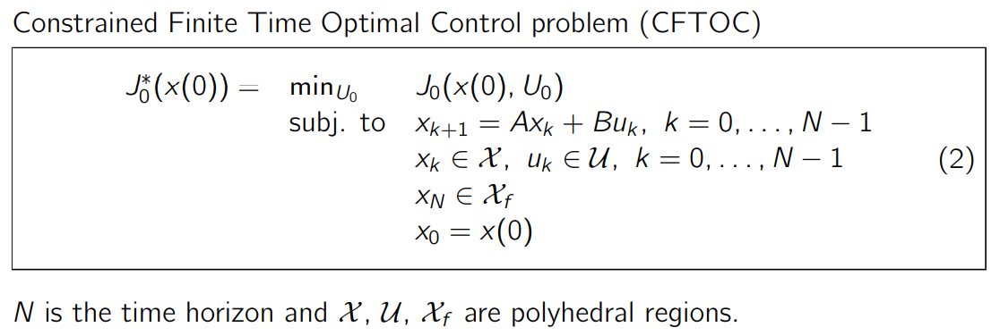

[toc]

----

# 1 Constrained Linear Optimal Control

## 1.1 Problem formulation

## 1.2 Unconstrained Solution 无约束的解在上一章

---

# 2  Constrained Optimal Control: 2-Norm

# 2.1 Problem formulation

## 2.2 Construction of the QP with substitution 问题的重构

 

>cost函数重构的方式以及用到的F,H,Y等符号，看第5个slice,这里截取一部分：

## 2.2.1 constraint的重构

---

# 3  Constrained Optimal Control: 1-Norm and ∞-Norm

--- 

# 4 RHC Notation

